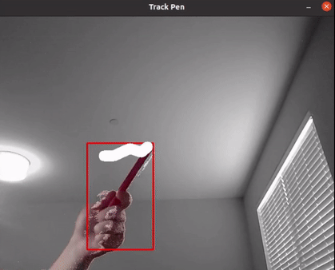
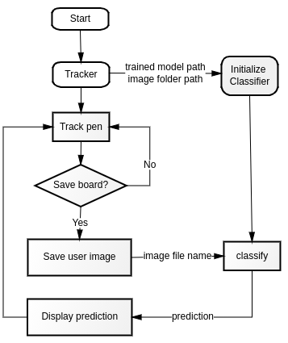

# Handwriting Classifier with Camera
- Sonia Yuxiao Lai   
- 2021 Winter Project

## Overview
The main goal of this project is to classify letters written in front of a camera. First, the project tracks a pen to write letters in front of the camera in a way that the frames are interpreted as a canvas. Then, it will store canvas into an image, use a pre-trained model to classify the letter, and print the result back to frames. The project provides an option to store the last classified letter into a custom dataset that can be used for further learning. The output frames can also be streamed onto a virtual camera so that the results are displayable in Zoom. Check out the video demo [here](https://youtu.be/9Fl5xeTdH-4).

## Requirements
* [PyTorch](https://pytorch.org/get-started/locally/)
* [EMNIST](https://arxiv.org/abs/1702.05373) (this is only required when training the model)
* [OpenCV](https://opencv.org/#)
* [pyrealsense2](https://intelrealsense.github.io/librealsense/python_docs/_generated/pyrealsense2.html)
* [Intel&reg;RealSense&trade; Depth Camera D435i](https://www.intelrealsense.com/depth-camera-d435i/)
* [v4l2loopback](https://github.com/umlaeute/v4l2loopback)  
    * v4l2loopback-dkms   
    * v4l2loopback-util  
    * Notice: an error message `TypeError: unsupported operand type(s) for +: 'range' and 'list'` may occur when importing from `v4l2`, go ahead and change `range(_,_)` to `list(rang(_,_))` in the source code. [See bug report.](https://bugs.launchpad.net/python-v4l2/+bug/1664158)   
* [ffmpeg](https://www.ffmpeg.org/) 

## How to Use
#### Options
- Run project using the default configuration, which is to track pen using a depth camera and Haar Cascade object detection. 
    ```
    python3 tracker.py
    ```
- Enable streaming to a virtual camera while tracking pen with depth camera and Haar Cascade object detection.
    ```
    python3 tracker.py -s
    ```
- Track pen using the integrated webcam and a color range. The default color is red.
    ```
    python3 tracker.py -w
    ``` 
- Other options included in `Tracker` are as follows:
    - `use_default_model` - whether to use the default trained model `models/model_letters.pth`.
    - `model_path` - path to customized PyTorch model.
    - `virtual_cam` - address of customized virtual camera to stream to.   
#### Keyboard Input     
While running the code, press the following keys to execute corresponding functions.   
- `Q` or `ESC` - exit window.    
- `C` - clear writing board.   
- `W` - clear predictions displayed on the screen.   
- `S` - save writing and classify letter.   
- `A` - save current writing to user dataset.   
- `N` - redo classification, will display the next possible letter.   
- `E` - switch between pen and eraser.   
- Move pen away from the camera or rotate pen to indicate lifting pen

## Contents
1. Machine Learning  
    - [PyTorch Letter Training](models/README.md)
    - [PyTorch Letter Classification](models/README.md#pyTorch-letter-classification)
2. Computer Vision 
    - [Track Colored Pen](#track-colored-pen) 
    - [Haar Cascade Object Detection](cascade/README.md)
3. Integration
    - [Combine Classifier with Opencv Frames](#combine-classifier-with-opencv-frames)
3. Stream 
    - [Configure Virtual Camera](#configure-virtual-camera)

## Track Colored Pen
The project provides an option to track a colored pen with the help of [OpenCV background subtraction](https://docs.opencv.org/3.4/d1/dc5/tutorial_background_subtraction.html). The default color range to track is HSV(135, 110, 50) to HSV(180, 250, 150). This range can be changed in `Tracker.get_tracekbar_val` function. Helper function `Tracker.enable_trackbar` can be used to find the range of colors to track. Notice that to filter out the noises, the position of the colored pen is defined as the average of positions in five consecutive frames, so the frame rate will be relatively slower.  



## Combine Classifier with Opencv Frames  
The project consists of two main classes: `Tracker` and `Classifier`. `Tracker` is responsible for tracking a pen in front of a camera, and `Classifier` is responsible for classifying user inputs, which is a cropped frame that bound the user's writing. When running `tracker.py`, `Tracker` will first initialize a `Classifier` class and start tracking pen using either color filtering or Haar Cascade object detection, then it will wait for keyboard inputs. Specific settings are explained in [How to Use](#how-to-use). A simplified workflow of how `Tracker`  and `Classifier` are integrated is shown below. 



When initializing `Tracker`, the user needs to specify a path to a trained model and a folder to store user inputs so that `Classifier` can load the network at the start and wait for images to be classified. The input for function `Classifier.classify` is an image file name in form `<index>_<random_string>.png`. More details can be found in [PyTorch Letter Classification](models/README.md#pyTorch-letter-classification).

## Configure Virtual Camera
The resulting outputs of this project can be streamed onto a virtual camera so that Zoom (or Skype etc.) can display the processed frames. This function can be set available by calling `python3 tracker.py -s`. Before running the command, follow the instruction below to set up virtual cameras. Notice that these commands are only for the Linux system.
1. Configure two virtual camera loopbacks for `Tracker`
    ```
    sudo modprobe v4l2loopback devices=2 video_nr=10,11 card_label="Tracker_1","Tracker_2"
    ```

2. Check if loopbacks are correctly configured.   
    ```
    v4l2-ctl --list-devices -d10
    ```
    Example output:   
    ```
    Tracker_1 (platform:v4l2loopback-000):   
        /dev/video10  

    Tracker_2 (platform:v4l2loopback-001):  
            /dev/video11   
    ```

3. Test with Gstreamer.   
    ```
    gst-launch-1.0 videotestsrc ! v4l2sink device=/dev/video10   
    ```
    Example output:
    ```
    Setting pipeline to PAUSED ...
    Pipeline is PREROLLING ...
    Pipeline is PREROLLED ...
    Setting pipeline to PLAYING ...
    New clock: GstSystemClock
    ```

4. Keep `tracker.py` running and check output using VLC Media Player (other players such as `cheese` may also work).
    ```
    vlc v4l2:///dev/video11
    ```
    The video shown on `/dev/video11` should now be the same as the output frames of `tracker.py`
    <br>

5. Stream to another virtual camera loopback.   
    ```
    ffmpeg -f v4l2 -r 60 -s 640x480 -i /dev/video11 -vcodec rawvideo -pix_fmt yuv420p -threads 0 -f v4l2 /dev/video10
    ```
6. Open Zoom and select `Tracker_1`. Now the video displayed should be the same as the resulting frames of `tracker.py`.   

 


7. When finished with the project, remove loopback devices.
    ```  
    sudo modprobe -r v4l2loopback   
    ```
