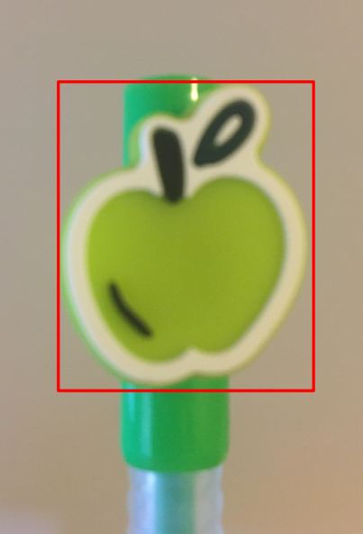
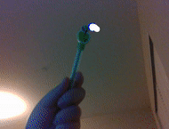
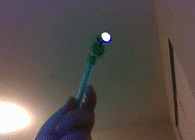

# Handwriting Classifier with Camera
* Sonia Yuxiao Lai
* 2021 Winter Project

## Overview
The main goal of this project is to classify letters written in front of a depth camera. First, the project tracks a pen using Haar Cascade algorithm to write letters in front of a depth camera in a way that the frames are interpreted as a canvas. Then, it will store canvas into an image, use a pre-trained model to classify the letter, and print the result back to frames. The code provides an option to store the last classified letter into a custom dataset that can be used for further learning. The output frames can also be streamed onto a virtual camera so that the results are displayable in Zoom.

## Requirements
* [PyTorch](https://pytorch.org/get-started/locally/)
* [EMNIST](https://www.nist.gov/itl/products-and-services/emnist-dataset) (this is only required when training the model)
* [OpenCV](https://opencv.org/#)
* [pyrealsense2](https://intelrealsense.github.io/librealsense/python_docs/_generated/pyrealsense2.html)
* [Intel&reg;RealSense&trade; Depth Camera D435i](https://www.intelrealsense.com/depth-camera-d435i/)
* [v4l2loopback](https://github.com/umlaeute/v4l2loopback)  
    * v4l2loopback-dkms   
    * v4l2loopback-util  
    * Notice: an error message `TypeError: unsupported operand type(s) for +: 'range' and 'list'` may occur when importing from `v4l2`, go ahead and change `range(_,_)` to `list(rang(_,_))` in the source code. [See bug report.](https://bugs.launchpad.net/python-v4l2/+bug/1664158)   
* [ffmpeg](https://www.ffmpeg.org/) 

## Contents
1. Machine Learning  
    - [PyTorch Letter Training](#pytorch-letter-training)
    - [PyTorch Letter Classification](#pytorch-letter-classification)
2. Computer Vision 
    - [Track Colored Pen](#track-colored-pen) vs. [Haar Cascade Object Detection](#haar-cascade-object-detection)
3. Integration
    - [Combine Classifier with Opencv Frames](#combine-classifier-with-opencv-frames)
3. Stream 
    - [Configure Virtual Camera](#configure-virtual-camera)

## PyTorch Letter Training
## PyTorch Letter Classification
## Track Colored Pen
## Haar Cascade Object Detection
This project uses haar cascade train and detect functions provided by OpenCV to track a pen. The pen used for tracking is bought from  [yoobi](https://yoobi.com/collections/pens/products/scented-gel-pens-6-pack-fruit). To ensure that the pen is easily classifiable, a distinctive portion of the pen is chosen as the object to detect. The tracked portion is bounded by a red box in the image shown on the right below. 
   

The Haar Cascade model used in this project is trained using around 1,000 positive images and 500 negative images. The classifier is able to correctly detect the pen in front of the camera; however, it will occasionally misclassify other objects (such as fingers or shadows of similar shape) as the pen. To solve this problem without having to retrain the model with more images, the code assumes that only one object is detected at each frame and that 10 objects need to be detected before defining it as the pen (this is defined by the `minNeighbors` parameter of the `detectMultiScale` function). The code also bounds the size of detection between 30x30 and 80x80 pixels. With these conditions, small noises are neglected, but it also has the risk of not recognizing the pen due to large `minNeighbors`. This problem is solved by increasing the frame rate. 

`tracker.py` processes color frames from depth camera at a frame rate of 60 fps. The performance is better than running at 30 fps (The comparison can be seen below or from `object_detection.py` which is set to be at 30 fps). However, more false detections are found in this case, so `tracker.py` adds in another condition that if the current detection is around twice width or twice height pixels away from the previous detection, then this detection is considered incorrect. The images below show `tracker.py` running at 30fps (left) and 60fps (right) respectively.

   

#### Related Files
- `cascade/cascade.xml` - the haar cascade model that detects the green yoobi pen
- `object_detection.py` - code to visualize the performance of the haar cascade model. 
- `data_gen.py` - helper functions for training a custom haar cascade  

#### How to train  a haar cascade model for a custom object:
- Useful links:    
    [Official Opencv document on training](https://docs.opencv.org/3.4/dc/d88/tutorial_traincascade.html)   
    [Tutorial by Naotoshi Seo to train a model to detect faces](http://note.sonots.com/SciSoftware/haartraining.html)   
    [Tutorial to train a model used in gaming](https://www.youtube.com/watch?v=XrCAvs9AePM)   

- Instructions:     
    1. Create a folder named `n`. Capture a folder of negative images by pressing `s` when running `object_detection.py` at `<root>/n`. If the number of negative images is not satisfying, use the helper function `download_neg_images()` provided in `data_gen.py` to download images specified in `keywords` from Bing. Run `data_gen.py` to write `neg.txt` that stores path to negative images to be used in training.
    2. Create a folder named `p`. Capture a folder of positive images by pressing `s` when running `object_detection.py` at `<root>/p`. To obtain a good result, a ratio of 2:1 for positive:negative image counts is suggested. Be sure that distorted or cropped objects are also captured.
    3. Create a folder named `cascade`. The folder structure should now be:    
        ``` 
        <root>   
            /cascade   
            /n   
            /p   
            codes.py   
            neg.txt   
        ```
    3. Run the following commands one by one at `<root>` to train a model. Notice that these commands are only available for OpenCV version 3.14 or lower, so it is advised to make this version of the OpenCV library from source. (These command lines prefix are only suitable for Linux system)  
        1. Annotate images stored in `<root>/p` and write annotations to `pos.txt`. Follow instructions to draw bounding boxes of objects to detect.    
            ``` 
            <path_to_opencv_source_code>/build/bin/opencv_annotation --annotations=pos.txt --images=p/
            ```
        
        2. Write `pos.vec` from `pos.txt`.    
            `num` - a number larger than positive image counts.   
            `w` - width of object in frames.   
            `h` - height of object in frames.      
            ```
            <path_to_opencv_source_code>/build/bin/opencv_createsamples -info pos.txt -w 24 -h 24 -num 2000 -vec pos.vec
            ```
        
        3. Start training.    
        `numPos` - the number of positive images to be used in training. This number should be around 90% of positive image counts.   
        `numNeg` - a number larger than negative image counts.   
        `numStages` - the number of stages used during training. Increasing this number will increase the accuracy of the model but will also increase training time. 
        `w` - width of object in frames. This should be the same as the one used in the previous command.    
        `h` - height of object in frames. This should be the same as the one used in the previous command.   
            ```
            <path_to_opencv_source_code>/build/bin/opencv_traincascade -data cascade/ -vec pos.vec -bg neg.txt -numPos 900 -numNeg 600 -numStages 20 -w 24 -h 24
            ```

        4. Replace the `cascade/cascade.xml` with the newly trained model to have `object_detection.py` and `tracker.py` track the customized object. 


## Combine Classifier with Opencv Frames  

## Configure Virtual Camera
The resulting outputs of this project can be streamed onto a virtual camera so that Zoom (or Skype etc.) can display the processed frames.This function can be set available by callling `tracker = Tracker( enable_stream = True)` in `main` of `tracker.py`. Then, follow the instruction below to start streaming. Notice that these commands are only for Linux system.
1. Configure two virtual cameras loopbacks for `Tracker`
    ```
    sudo modprobe v4l2loopback devices=2 video_nr=10,11 card_label="Tracker_1","Tracker_2"
    ```

2. Check if loopbacks are correctly configured.   
    ```
    v4l2-ctl --list-devices -d10
    ```
    Example output:   
    ```
    Tracker_1 (platform:v4l2loopback-000):   
        /dev/video10  

    Tracker_2 (platform:v4l2loopback-001):  
            /dev/video11   
    ```

3. Test with Gstreamer.   
    ```
    gst-launch-1.0 videotestsrc ! v4l2sink device=/dev/video10   
    ```
    Example output:
    ```
    Setting pipeline to PAUSED ...
    Pipeline is PREROLLING ...
    Pipeline is PREROLLED ...
    Setting pipeline to PLAYING ...
    New clock: GstSystemClock
    ```

4. Keep `tracker.py` running and Check output using VLC Media Player (other players such as `cheese` may also work).
    ```
    vlc v4l2:///dev/video11
    ```
    The video shown on `/dev/video11` should now be the same as the output frames of `tracker.py`

5. Stream to another virtual camera loopback.   
    ```
    ffmpeg -f v4l2 -r 60 -s 640x480 -i /dev/video11 -vcodec rawvideo -pix_fmt yuv420p -threads 0 -f v4l2 /dev/video10
    ```
6. Open Zoom and select `Tracker_1`. Now the video displayed should be the same as the resulting frames of `tracker.py`.

7. When finished with the project, remove loopback devices 
    ```  
    sudo modprobe -r v4l2loopback   
    ```


