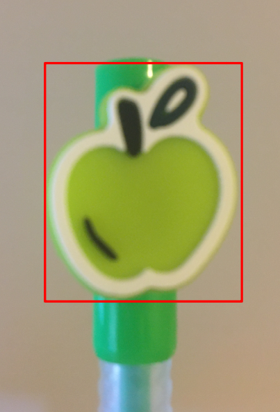

# Haar Cascade Object Detection
The project uses [Haar Cascade](https://docs.opencv.org/3.4/db/d28/tutorial_cascade_classifier.html) train and detect functions provided by OpenCV to track a pen. The pen used for tracking is bought from  [yoobi](https://yoobi.com/collections/pens/products/scented-gel-pens-6-pack-fruit). To ensure that the pen is easily classifiable, a distinctive portion of the pen is chosen as the object to detect. The tracked portion is bounded by a red box in the image shown on the right below. The Haar Cascade model used in this project is trained using around 1,000 positive images and 500 negative images.   

   


#### Related Files
- `cascade/cascade.xml` - the Haar Cascade model that detects the green yoobi pen.
- `object_detection.py` - code to visualize the performance of the  Haar Cascade  model. 
- `data_gen.py` - includes helper functions for training a custom  Haar Cascade model.

#### How to train  a Haar Cascade model for a custom object:
- Useful links:    
    [Official Opencv document on training](https://docs.opencv.org/3.4/dc/d88/tutorial_traincascade.html)   
    [Tutorial by Naotoshi Seo to train a model to detect faces](http://note.sonots.com/SciSoftware/haartraining.html)   
    [Tutorial to train a model used in gaming](https://www.youtube.com/watch?v=XrCAvs9AePM)   

- Instructions:     
    1. Create a folder named `n`. Capture a folder of negative images by pressing `s` when running `object_detection.py` at `<root>/n`. If the number of negative images is not satisfying, use the helper function `download_neg_images()` provided in `data_gen.py` to download images specified in `keywords` from Bing. Run `data_gen.py` to write `neg.txt` that stores path to negative images to be used in training.
    2. Create a folder named `p`. Capture a folder of positive images by pressing `s` when running `object_detection.py` at `<root>/p`. To obtain a good result, a ratio of 2:1 for positive:negative image counts is suggested. Be sure that distorted or cropped objects are also captured.
    3. Create a folder named `cascade`. The folder structure should now be:    
        ``` 
        <root>   
            /cascade   
            /n   
            /p   
            codes.py   
            neg.txt   
        ```
    3. Run the following commands one by one at `<root>` to train a model. Notice that these commands are only available for OpenCV version 3.14 or lower, so it is advised to make this version of the OpenCV library from source. (These command lines prefix are only suitable for Linux system)  
        1. Annotate images stored in `<root>/p` and write annotations to `pos.txt`. Follow instructions to draw bounding boxes of objects to detect.    
            ``` 
            <path_to_opencv_source_code>/build/bin/opencv_annotation --annotations=pos.txt --images=p/
            ```
        
        2. Write `pos.vec` from `pos.txt`.    
            `num` - a number larger than positive image counts.   
            `w` - width of object in frames.   
            `h` - height of object in frames.      
            ```
            <path_to_opencv_source_code>/build/bin/opencv_createsamples -info pos.txt -w 24 -h 24 -num 2000 -vec pos.vec
            ```
        
        3. Start training.    
        `numPos` - the number of positive images to be used in training. This number should be around 90% of positive image counts.   
        `numNeg` - a number larger than negative image counts.   
        `numStages` - the number of stages used during training. Increasing this number will increase the accuracy of the model but will also increase training time. 
        `w` - width of object in frames. This should be the same as the one used in the previous command.    
        `h` - height of object in frames. This should be the same as the one used in the previous command.   
            ```
            <path_to_opencv_source_code>/build/bin/opencv_traincascade -data cascade/ -vec pos.vec -bg neg.txt -numPos 900 -numNeg 600 -numStages 20 -w 24 -h 24
            ```

        4. Replace the `cascade/cascade.xml` with the newly trained model to have `object_detection.py` and `tracker.py` track the customized object. 
