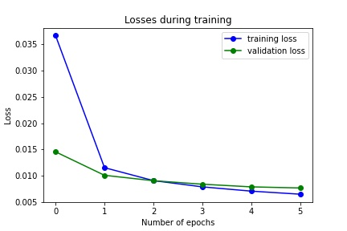
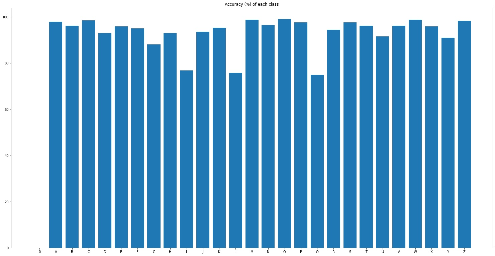

## PyTorch Letter Training
#### EMNIST Dataset
This project trains a model using Pytorch and EMNIST letter dataset. The classes are alphabets from A to Z. Due to this structure, lowercase letters will also be classified as uppercases. Since the labels ranges from 1 to 26, a meaningless member 0 is added as a class member so that `classes[label]` results in the correct output.    

  

When loading the dataset, all EMNIST images are transformed into Pytorch tensor object and normalized. Both train and test sets are shuffled. The batch size of the loaders are the same as the size of class, which is 26. One example of a batch of images with their ground truth is shown below. 

  

#### Neural Network Architecture
The neural network used to train EMNIST letter dataset has three hidden layers. Two 2D convolution layers are applied to the input channel before accessing the hidden layers. The first convolution outputs 64 channels with kernal size 5; the second convolution outputs 128 channels with kernal size 5. The succeeding hidden layers are of size 128, 64, and 27 (size of classes including the first meaningless member) respectively. At the beginning, a 2d max pooling is applied to the inputs. All layers are followed by rectified linear units (ReLU) as their activation functions. The architecture is also explained in the image below. 

The network is trained using 6 epochs and took around 10 minutes. The resulting accuracy is 94.0%. The loss after the last epoch of training is 0.00642. Compared to the previous loss 0.00698. It is likely to increase accuracy of the model by training a few more epochs, but may also cause overfitting. Given that the decrease in loss in as small as 1e-4, 6 epochs of training should be sufficient. 
   

#### Model Accuracy
The overall accuray of trained model on EMNIST letter dataset is around 93.5%. Accuracies on each class for most classes are above 90%. 
  

As seen from the image above, the exceptions are G, I, a L. It is reasonable that I and L are easily confused, given that lower case i and l are very similar. As for G, this is likely to be confused with lowercase Q. The images below are lowercase letters I, L, Q, G from left to right.  
       

## PyTorch Letter Classification
#### Classify User Input
User's writing without labels are stored in folder `user_images`. This is also the default folder for `UserImageDataSet` loader. When loading user inputs, images are resized to 28x28 px to makes sure that writings of different sizes are also correctly processed. Other transforms are the same as training.  

#### Test User Input
When running `tracker.py`, images can be saved with labeled ground truth by pressing `Y` (make sure the prediction displayed on screen is correct). `net_classifier.py` includes a user data loader `UserKnownImageDataSet` that returns both data image and label. This loader will loop through the `user_dataset` folder to load the dataset. All images stored in this folder are in form `<index>_<ground_truth>_<random_string>.png`, where `<index>` is the order of file in folder (so the last file has index equals size_of_folder-1). This structure allows `UserKnownImageDataSet` to identify unique images using `<index>` and extract image's ground truth from file name.  

To test user inputs, at least three images are stored for each label. The overall accuracy is 96.3%. Accuracies for each class is shown below. 
 

Most classes are able to be classified. The images that are misclassified is likely due to the shaking behavior while writing. Some of the lines are not correctly bounded or closed. One example is the D below that is classified as P. 
 

To solve this problem, the pen in `tracker.py` can be swtiched between mode writing and erasing by pressing `E`.

## Related Files
- `models/model_letter.pth` - trained neural network for classifying EMNIST letters dataset
- `models/Pytorch_Training.ipynb` - outlines the steps on training the neural network
- `models/Pytorch_Testing.ipynb` - tests trained neural network on user inputs (writing infron of a depth camera)
- `net_classifier.py` - includes helper classes and functions for classifying and testing uer inputs
