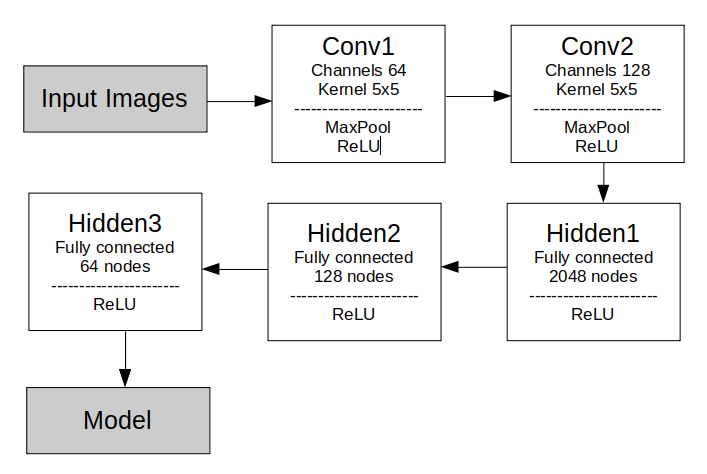

## PyTorch Letter Training
#### EMNIST Dataset
Th3 project trains a model using [Pytorch](https://pytorch.org/) and [EMNIST](https://arxiv.org/abs/1702.05373) letter dataset. The classes are alphabets from A to Z. Due to this structure, lowercase letters will also be classified as uppercases. Since the labels range from 1 to 26, a meaningless member 0 is added as a class member so that `classes[label]` results in the correct output.    

  

#### Neural Network Architecture
The neural network used to train the EMNIST letter dataset has three hidden layers. Two 2D convolution layers are applied to the input channel before accessing the hidden layers. The first convolution outputs 64 channels with kernel size 5; the second convolution outputs 128 channels with kernel size 5. The succeeding hidden layers are of size 128, 64, and 27 (size of classes including the first meaningless member) respectively. In the beginning, a 2d max pooling is applied to the inputs. All layers are followed by rectified linear units (ReLU) as their activation functions.

#### Train Model
The network is trained using 5 epochs and took around 25 minutes. The final accuracies on the training set and validation set are 94.0% and 93.3% respectively.    
   

The overall accuracy of the trained model on the EMNIST letter dataset is 93.3%. Accuracies on each class for most classes are above 90%. The image below shows the accuracies of the model for each class. 
  

## PyTorch Letter Classification
#### Classify User Input
User's writing without a label is stored in folder `user_images/`. The class `Classifier` in `net_classifier.py` takes two arguments:
- `path` - specifies path to a pre-trained model. The default is `models/model_letters.pth`. 
- ` img_folder_path` - specifies where user inputs are stored. The default is `user_images/`.   

When calling function `Classifier.classify`, user needs to input
- `image_name` - file name in form `<index>_<random_string>.png`. This lets the loader know which image to predict. 
- `pred_idx` - an integer equals or larger than 0. This lets the model outputs the `pred_idx`th possible label predicted.

#### Test User Input
When running `tracker.py`, images can be saved with labeled ground truth by pressing `Y` (make sure the prediction displayed on the screen is correct). `net_classifier.py` includes a user data loader `UserKnownImageDataSet` that returns both data image and label. This loader will loop through the `user_dataset/` folder to load the user dataset. All images stored in this folder have names in the form `<index>_<ground_truth>_<random_string>.png`, where `<index>` is the order of file in the folder (so the last file has index equals size_of_folder-1). This structure allows `UserKnownImageDataSet` to identify unique images using `<index>` and extract the image's ground truth from the file name.  

To test the model's performance on user inputs, at least three images are stored for each label. The overall accuracy is 96.3%. Accuracies for each class is shown below. Notice that the testing set has only 178 images and are all written under the same condition, so the accuracies may be biased. 
 

## Related Files
- `models/model_letter.pth` - trained neural network for classifying letters.
- `models/Pytorch_Training_Letters.ipynb` - outlines the steps on training the neural network using the EMNIST letters dataset.   
- `models/Pytorch_Testing.ipynb` - tests the trained neural network on user inputs (writing in front of a depth camera).
- `net_classifier.py` - includes helper classes and functions for classifying and testing user inputs.
- [user_dataset.zip](https://drive.google.com/file/d/1Rhdzq3cQDivl3OSlLLYgq3ii3eXRylLw/view?usp=sharing) - a zip file of images used for testing accuracy of the model on user inputs.